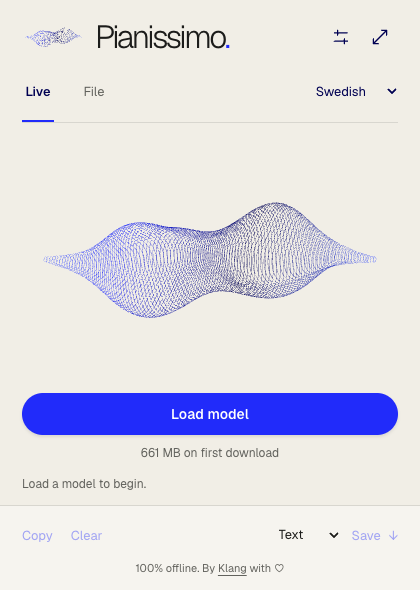

# Pianissimo for Chrome

[](https://github.com/klang-ai/pianissimo-chrome/actions/workflows/ci.yml)
[](LICENSE)

Transcribe audio files and microphone recordings on your computer. Your audio and transcripts stay on your device. After the first model download, transcription works offline.



## Install

Download `pianissimo-chrome-0.3.0.zip` from [GitHub Releases](https://github.com/klang-ai/pianissimo-chrome/releases/latest) and extract it. Open `chrome://extensions`, enable **Developer mode**, choose **Load unpacked** and select the extracted folder containing `manifest.json`.

To build from source:

```sh
git clone https://github.com/klang-ai/pianissimo-chrome.git
cd pianissimo-chrome
npm ci
npm run build
```

Use Node.js 24 or later. Load the resulting `dist/` folder through `chrome://extensions`.

## Use

1. Pin Pianissimo and open its toolbar icon.
2. Choose **Swedish** or **Multilingual · Parakeet**, then **Load model**.
3. Select **Start recording**, or choose an audio file in **File**.
4. Stop recording to finish the transcript. Copy it or save TXT, SRT, VTT or JSON.

**Expand** opens the same session in a tab. Recording, downloads and transcription continue when you close the popup. Reopen it to stop recording.

If Chrome needs microphone permission, **Allow microphone** opens a separate window. Choose **Allow and record** there and keep that window open while recording. Closing it finishes the recording.

Live text is provisional and can change until processed. Review the finished transcript: recognition and timestamps can be wrong, and speech can be omitted, including in highly repetitive recordings.

## Languages and models

| Selection    | Model                  | Precision     | First download |
| ------------ | ---------------------- | ------------- | -------------: |
| Swedish      | Klang Pianissimo       | INT8, default |         661 MB |
| Swedish      | Klang Pianissimo       | INT4          |         515 MB |
| Multilingual | NVIDIA Parakeet TDT v3 | INT8          |         671 MB |

Multilingual mode automatically recognizes 25 European languages. See **Settings → Supported languages** for the complete list. Norwegian is not supported by this model. Choose the model before loading; switching models releases the current model and keeps each download cached separately.

Inference runs on the CPU using bundled WebAssembly. Use a modern desktop with enough memory for the model and its working buffers. Speed depends on your hardware. The extension requires Chrome 120 or later; [validation](docs/VALIDATION.md) records the environments actually tested.

Files are decoded in windows, without a fixed size or duration cap. Device resources still limit very long recordings. If live transcription falls too far behind, capture stops and the captured audio is finished. Speaker identification, translation and system-audio capture are not included.

## Privacy

Audio and transcripts are processed locally. There are no accounts, advertising identifiers or analytics. Models are downloaded from Hugging Face and verified against pinned SHA-256 hashes. Hugging Face receives normal download metadata, including your IP address.

Transcripts remain in session memory until cleared or the extension session ends. Closing the popup alone does not end the session. **Settings → Delete downloaded models** removes the model caches. [Read the privacy policy](PRIVACY.md).

## Development

See [CONTRIBUTING.md](CONTRIBUTING.md) for setup, checks and releases.

- [Architecture and data flow](docs/ARCHITECTURE.md)
- [JavaScript SDK](docs/SDK.md)
- [Test coverage and limits](docs/VALIDATION.md)
- [Security reporting](SECURITY.md)
- [Changelog](CHANGELOG.md)

## Licenses

Pianissimo's code is [MIT licensed](LICENSE). The Swedish Pianissimo and NVIDIA Parakeet model weights are separately licensed under CC BY 4.0 and downloaded from pinned ONNX exports. Model weights are not included in the extension archive.

The bundled runtime, decoder and font have their own licenses. See [THIRD_PARTY_NOTICES.md](THIRD_PARTY_NOTICES.md) and [fixture provenance](tests/fixtures/README.md). Klang's name and brand marks remain Klang's identity.
